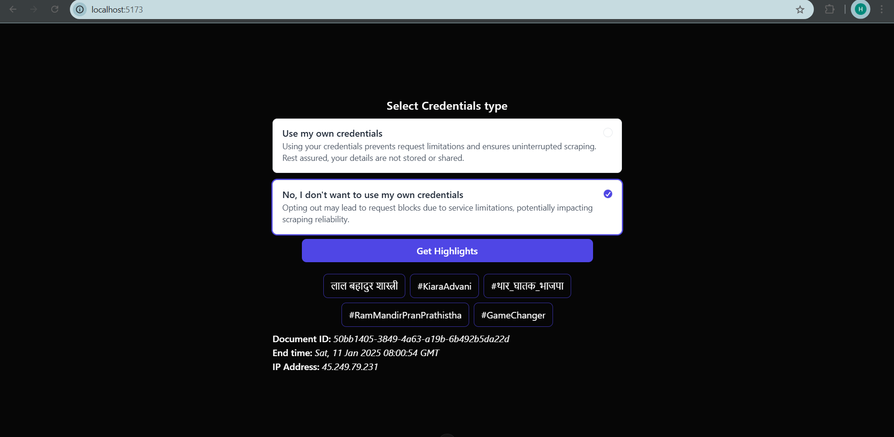
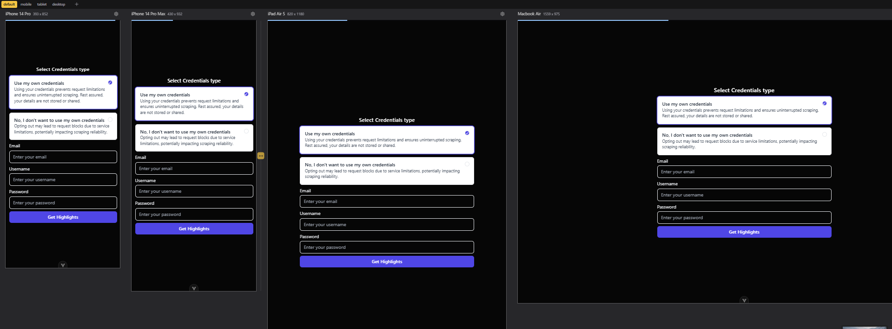

## Selenium Twitter Automation
This project is a full-stack web application designed to deliver a seamless user experience by integrating a robust backend with an intuitive frontend. The application leverages **Python** and **Node.js** for backend and frontend development, respectively, and aims to implement advanced functionalities such as automated workflows, data fetching, and proxy integration.

The backend uses Flask and Selenium for handling APIs and automation tasks, while the frontend is built with modern JavaScript frameworks for dynamic and responsive interfaces. This project is currently under development and includes features like authentication and data scraping. Future improvements include implementing a proxy setup and deploying the application using Docker.



[View More Outputs](./outputs)

### Table of Contents
  1. [Project Overview](#project-overview)
  2. [Prerequisites](#prerequisites)
  3. [Setup Instructions](#setup-instructions)
  4. [Challenges Faced](#challenges-faced-in-project-setup-and-development)
  5. [Conclusion](#conclusion)

### Project Overview  
This project is a full-stack application that consists of a Flask backend and a Node.js frontend. It uses Python for the backend server and Node.js for the frontend. The project aims to automate some processes using Selenium, and the frontend interacts with the backend through RESTful APIs.  
  
### Prerequisites  
Before setting up the project, ensure that the following software is installed on your system:  
- Python (3.12 or later)  
- Node.js (16.x or later)  
- pnpm (recommended package manager for frontend dependencies, but you can use npm if preferred)  
  
You can install `pnpm` using the following command if you don't have it:  
```commandline  
npm install -g pnpm  
```  
  
---  
  
## Setup Instructions  
Follow these steps to get your project up and running:  
1. **Clone the Repository** 
```commandLine
	git clone <repository-url>  
	cd <project-directory> 
```
2. **Install Backend Dependencies**
   In the root directory of the project, install all the required Python dependencies.
```commandLine
pip install -r requirements.txt`
```
3. __Create .env Files__
   Before running the application, you need to create `.env` files in both the frontend and backend to store necessary environment variables.
   **Frontend (.env file in `frontend/client` directory)**
   In the `frontend/client` folder, create a `.env` file with the following fields:
```
   VITE_API_URL=<backend-connection-uri>
```

   **Backend (.env file in the root folder)**
   In the backend root folder, create a `.env` file with the following fields:
```
EMAIL=<twitter-login-email*> 
PASSWORD=<twitter-login-password*> 
TW_USERNAME=<twitter-login-username*>

PROXYMESH_USERNAME=<proxymesh-username>
PROXYMESH_PASSWORD=<proxymesh-password>
PROXYMESH_HOST=<proxymesh-host>
PROXYMESH_PORT=<proxymesh-port>

MONGO_URI=<mongodb-cluster-uri*>
```

1.  __Install Frontend Dependencies__
   Next, navigate to the frontend client directory and install the required dependencies.
```commandLine
cd frontend/client
pnpm install
```
5. __Start the Development Server__
   Once the dependencies are installed, you can start the frontend development server.
```commandLine
pnpm dev
```
6. **Start the Backend server**
   Either run `app.py` file manually or `python app.py`

---
## Challenges Faced in Project Setup and Development
1. __Authentication Error and Timeout Issues__
   While setting up the automation system, I encountered a significant issue regarding authentication and connection timeouts. Initially, the system was facing **authentication errors** when attempting to connect to external services. This caused delays in the communication between different components.
   I attempted to resolve the issue by increasing the **timeout values** to give the system more time to authenticate and connect. However, despite making these adjustments, the issue persisted. This required further investigation into the network and connection settings, especially when the system was running in Docker, where network configurations can sometimes be tricky due to container isolation.

   **Possible causes of the issue:**
	   - Network configuration within Docker containers not properly routed.
	   - Connection authentication might not have been handled correctly across Docker services.

   __Solution Steps:__
	   - Continued debugging of the network configurations.
	   - Attempted increasing the timeout for specific services in the system.

2. __Issues with Installing Chrome SDK on Docker Image__
   While setting up the **Chrome SDK** on the Docker image to enable Chrome/Chromium for Selenium, I ran into issues while **connecting the ChromeDriver with Selenium**.
   Initially, I tried to install Chrome on the Docker image and set up the necessary dependencies to run Selenium with the browser. However, the connection between the **ChromeDriver** and **Selenium** failed repeatedly. This was due to several factors, including missing or misconfigured dependencies and incorrect paths to the Chrome binary.
   
	**Challenges faced:**
	- Missing dependencies like libraries required to run Chrome in a headless mode.
	- Misconfigured paths for the **Chrome binary**, leading to the failure of Selenium in locating Chrome/Chromium.

    __Possible Causes:__
    - The **Docker image** used may have lacked the necessary Chrome/Chromium dependencies or binary.
    - Configuration issues in the environment variables pointing to the Chrome/Chromium binary.

	**Solution Steps:**
	- Further investigation into the Chrome SDK and the Docker configuration was necessary.
	- Tried different Docker images, including the `selenium/standalone-chrome` image, but issues with driver connections persisted.

3. __Using `selenium/standalone-chrome` Image with Selenium (Previously Working, Now Failing)__
   I eventually switched to using the **`selenium/standalone-chrome`** image, which worked well in the beginning, and the setup functioned correctly for a while. However, after some time, I encountered another issue when the system **started failing to fetch highlights**, returning an empty list.
   This issue arose when the **ChromeDriver** was working fine with Selenium, but suddenly, despite no significant code changes, the **highlight fetching mechanism** started failing.

	__Challenges faced:__
	- The issue of fetching highlights was intermittent, with the system failing to return the expected data.
	- The integration between **Selenium** and **ChromeDriver** was working at times, but at other times, the data fetching would return empty results.

	__Possible Causes:__
	- The **Selenium session** might be getting interrupted or experiencing instability due to issues with the image's Chrome configuration.
	- There could be additional issues with the **timeout** or **resource allocation** for the Selenium tests within the Docker container.

	__Solution Steps:__
	- I am currently investigating potential issues with the Docker image, the way Chrome/Chromium is integrated, and whether resource allocation (memory or CPU) could be a factor causing the failure in fetching the expected data.
	- Another potential issue could be **stale WebDriver sessions** or failures in connection during long-running tests or operations.

## Yet to be Completed
There are a few tasks remaining to complete the project:
1. __Add Proxy Configuration__
   We need to configure a proxy to ensure that all external requests from the app go through a secure, controlled proxy server. This can help with features like IP rotation, and it is particularly useful when scraping data using tools like **Selenium**.
2. __Deploy Through Docker__
   The deployment of this project through Docker is in progress. Here's a summary of the steps we will be taking to deploy the application through Docker
   >__NOTE:__ Kindly look into `Dockerfile` and `docker-compose.yml` files.
   
---
## Conclusion
The project is functional with a simple setup for local development. The next steps involve:
1. Implementing proxy support for Selenium.
2. Deploying both the backend and frontend via Docker for easier setup in production.

Feel free to contribute by submitting pull requests or issues if you encounter any bugs or have suggestions for improvements!
